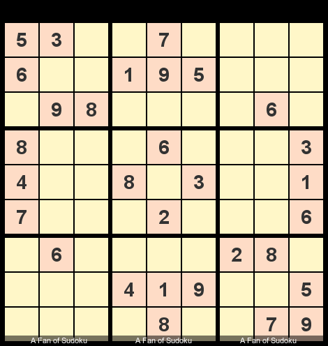

  

<h2 align="center">About Me</h2>

<h4 align="center">
  I’m a Computer Science and Engineering student.
   
  My journey is driven by an insatiable curiosity and a deep passion for learning and problem-solving.
     
  I thrive on challenges that push me to grow.
</h4>

 

  
  &nbsp;
  
  &nbsp;
  
  &nbsp;
    

 

- 🌱 **I’m Currently Learning** ***_<code><a href="https://expressjs.com/">Express.js</a></code> and <code><a href="https://www.java.com/en/">Java</a></code>_***

- 👨‍💻 **Visit My Most Favorite Project** ***[Here](https://mtbcoachingnetwork.vercel.app/)***

- 📫 **Contact Me:** [tanzeebul.tamim2003@gmail.com](mailto:tanzeebul.tamim2003@gmail.com)

 
 
 
<h3 align="left"><strong><em>Connect with me</em></strong></h3>

<h3 align="center">🖥️ Tech Stack ⚙️</h3>

    
    
    
    
    
    
     
  
   
   
    
    
    
    
     
    
    
    
  

---

 
  
<h3>📘 My Best Projects 📂</h3>

   
  

    
    
    
    
    
    
    
    
    
  

  

---

 
  
<h3>🔗 All My Projects 🗂️</h3>

---

  This index is a comprehensive reference for the diverse range of projects I've worked on. Each project is categorized for <strong>easy navigation</strong>, so you can quickly find the ones that interest you the most. 

 
<h2 style="font-weight: bold;">Project Status Overview</h2>

- ✅ Indicates a **_Completed Project_**
- 🚧 Indicates an ongoing project **_Under Active Development_**
- ⏸️ Indicates a project that is **_On Hold_** for now but will be **_Resumed Later_**

 

Although these repositories are primarily for personal learning purposes, <strong>constructive feedback</strong> is always appreciated.

---

### 1. 🎓 University Coursework 📚
  **(Includes Notes, Practice Problems, Assignments, Quizes, Solutions, Question Papers, and more.)**
   - ✅ ***[CSE 110 - Programming Language 1 (Python)](https://github.com/Tanzeebul-Tamim/CSE110-Fall-2023):*** Introductory programming course focused on the **Fundamentals of Computation**.
   - ✅ ***[CSE 111 - Programming Language 2 (Java)](https://github.com/Tanzeebul-Tamim/CSE111-Summer-Fall-2024):*** Introductory programming course emphasizing **Object Oriented Programming**.

### 2. 🧪 Miscellaneous Project 🛠️
   - 🚧 ***[Assignment Compiler: File Merge Tool (Java)](https://github.com/Tanzeebul-Tamim/Assignment-Compiler):*** Automates the creation of properly formatted coding assignment files for **CSE111** course.
   - ⏸️ ***[Age of The Evil Emperor (Java)](https://github.com/Tanzeebul-Tamim/Age-of-The-Evil-Emperor):*** A captivating **text-based RPG** (Role-Playing Game) featuring an immersive adventure storyline.
     
### 3. 🌐 Web Development 💻
   - ***'Professional Mountain Biking Coaching Network' (MERN Stack, Javascript):*** A platform for mountain biking enthusiasts to connect, communicate, and learn.
     - ✅ ***[Client End](https://github.com/Tanzeebul-Tamim/MTB-Coaching-Client)***
     - ✅ ***[Server End](https://github.com/Tanzeebul-Tamim/MTB-Coaching-Server)***
       
   - ***Fluffy Friends (MERN Stack, Javascript):*** A soft toy marketplace where users can browse, shop, and review products.
     - ✅ ***[Client End](https://github.com/Tanzeebul-Tamim/Fluffy-Friends-Client)***
     - ✅ ***[Server End](https://github.com/Tanzeebul-Tamim/Fluffy-Friends-Server)***
       
   - ***The Bengal Chefs' Pantry (MERN Stack, Javascript):*** Showcases top chef recipes and a curated selection of Bengali cuisine.
     - ✅ ***[Client End](https://github.com/Tanzeebul-Tamim/The-Bengal-Chefs-Pantry-Client)***
     - ✅ ***[Server End](https://github.com/Tanzeebul-Tamim/The-Bengal-Chefs-Pantry-Server)***
       
   - ⏸️ ***[UniMate-University Management System (MERN Stack, Typescript):](https://github.com/Tanzeebul-Tamim/UniMate-UMS)*** Showcases the core functionalities of a **university management system**.
   - ✅ ***[E-commerce API (MERN Stack, Typescript):](https://github.com/Tanzeebul-Tamim/TS_Mongoose_E-commerce_API)*** E-commerce backend with **Express**, **Mongoose** and **MongoDB**.
   - ✅ ***[Simple Tally Counter (MERN Stack, Typescript & Redux):](https://github.com/Tanzeebul-Tamim/Simple-Tally-Counter)*** A simple tally counter made by **Typescript-React** along with **Redux** for state management.
   - ✅ ***[Express TypeScript Mongoose Starter Pack (MERN Stack, Typescript):](https://github.com/Tanzeebul-Tamim/Express-Mongoose-TS-Starter_Pack)*** A **starter template** for **Express.JS** applications with **TypeScript** and **Mongoose** integration.
  
### 4. 🧠 Personal Learning 📖
  **(Includes Notes, Practice Problems, Basics, Fundamentals, and more.)**
   - ⏸️ ***[Java Fundamentals:](https://github.com/Tanzeebul-Tamim/JAVA-Fundamentals)*** Comprehensive notes, practice problems, and code exercises for mastering Core and Advanced **Java** concepts.
   - ✅ ***[Typescript Fundamentals:](https://github.com/Tanzeebul-Tamim/Typescript-Fundamentals)*** In-depth notes, practice problems, and exercises for learning Core and Advanced **TypeScript**.
   - ✅ ***[Solving Basic Problems with JavaScript:](https://github.com/Tanzeebul-Tamim/Basic-JS-Problem-Solving)*** Fundamental **JavaScript problems** with detailed solutions.
   - ✅ ***[MongoDB Queries and Aggregation:](https://github.com/Tanzeebul-Tamim/MongoDB-Queries-and-Aggregation-Notes)*** Notes on **queries, Aggregation Pipelines**, and practical use cases for **MongoDB**.
   - ✅ ***[Linux Handbook:](https://github.com/Tanzeebul-Tamim/Linux-Handbook)*** Notes on **Linux Commands** – Includes explanations, examples, and practical use cases. 🚀

---

  Each repository is equipped with a <strong>README</strong> file detailing its purpose and usage. Simply clone the repositories and follow the provided <strong>README</strong> instructions to set up and run the programs.

---

 
  
<h3>📈 My Stats & Activity 📊</h3>

  
  ---

  
  <h3>🔥 Streak Stats</h3>
    
  

    <h3>GitHub Profile Stats 💻</h3>

  

   
   <h3>💡 My Language Usage at a Glance</h3>
  
   

  <b><em>Note:</em></b> Top languages is only a metric of the languages   my public code consists of and doesn't   reflect experience or skill level.
   
   

 
  <h3>⏳ My Productive Hours 🚀</h3>
  
  

    
     
     
    
    &nbsp;
    
  

---

 
  
<h3>🚴‍♂️ Passions and Hobbies 🧩</h3>

### 
I'm a <em>Mountain Bike Athlete</em> 🚵🚴‍♀️

  I love mountain biking and performing MTB freestyle tricks. Check out my <a href="https://www.youtube.com/channel/UC2YN41MJxcYK7ZZRa9aR3-w" target="_blank"><strong>YouTube Channel</strong></a> where I share my freestyles and tricks!

  

 

---

### 
🧩🧊 I'm a <em>Speed Cuber</em>

  I'm also into speed cubing. I can solve the regular 3x3 cube in under 15 seconds and enjoy tackling a variety of other cubes, including all sizes from 2x2 up to 8x8.

  

 

---

### 
I'm a <em>Touch Typist</em> ⌨️💨

  I take pride in my ability to type quickly and accurately. I consistently achieve typing speeds of 120-130 words per minute.

  

 

---

### 
♟️🧠 I'm a <em>Chess Enthusiast</em>

  I enjoy playing chess, solving chess puzzles, and continuously improving my skills. Chess helps sharpen my problem-solving abilities.

  

 

---

### 
I'm a <em>Sudoku Solver</em> 🔢🧩

  Solving Sudoku puzzles is one of my favorite ways to challenge my brain. I solve a few puzzles every day to improve my logical thinking skills.

  

 

---

### 
💪🏋️‍♂️ I'm a <em>Calisthenics Enthusiast</em>

  I enjoy practicing calisthenics, focusing on bodyweight exercises that improve strength, flexibility, and endurance. It's a vital part of my fitness routine.

  

 

---

### 
I Like to Create with <em>Photoshop</em> 🖼️💡🖌️🎨

  I love using Photoshop for graphic design and creative projects. It allows me to bring my ideas to life through digital art and design.

  

  

 

---

### 
🖋️📖 I'm a <em>Fountain Pen Enthusiast</em>

  I enjoy writing with fountain pens. There's something deeply satisfying about the smooth ink flow and elegant nibs. My collection includes Lamy Safari, Pilot Metropolitan, Jinhao 92, Parker Vector, etc. Writing notes and solving problems with them makes studying even more enjoyable!

  

 

